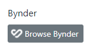

# CSM.Bynder Readme

## About

An [Orchard Core](https://www.orchardcore.net/) module for integrating with the digital asset management platform [Bynder](https://www.bynder.com/en/). Foremost, it provides the Bynder Field content field that can be added to content parts so Bynder resources can be browsed and attached.

You can also see a demo video of the module [here](https://www.youtube.com/watch?v=z2ZNxGOmIXs).

Note that the module depends on [Lombiq Gulp Extensions](https://github.com/Lombiq/Gulp-Extensions) and [Lombiq NPM MSBuild Targets](https://github.com/Lombiq/NPM-Targets).

## Configuration and Usage

You need to configure your Bynder Portal's URL to be used in all Bynder Fields via the `BynderOptions`, see its definition. See [the Orchard docs](https://docs.orchardcore.net/en/dev/docs/reference/core/Configuration/index.html) for more info on how such configuration works.

Bynder Field can be added and configured like any other fields in the content type editor. Then, you'll get a button that opens up the Bynder asset browser:

